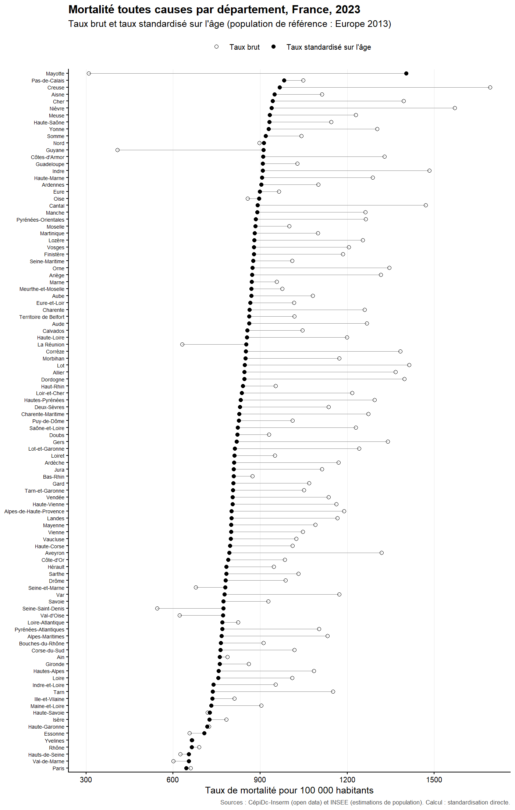

# Inégalités territoriales de mortalité — taux standardisés sur l'âge (CépiDc)

[](https://github.com/paulianne-fontoura/mortalite-territoriale-cepidc/actions)
[](LICENSE)

**Le livrable : [`report/note.pdf`](report/note.pdf).**

Chaîne de traitement reproductible qui mesure les écarts de mortalité entre
départements français à structure d'âge comparable, à partir des **données
ouvertes réelles** du **CépiDc-Inserm** et de l'**INSEE**. Les taux de mortalité
toutes causes sont **standardisés sur l'âge** par la méthode directe, avec la
population de référence européenne 2013.

ETL en **Python** (téléchargement à la source, harmonisation des classes d'âge,
appariement, sortie Parquet et CSV, contrôle qualité JSON), analyse en **R**
(standardisation directe, contrôle face aux taux publiés par le CépiDc), note
technique en **LaTeX**.

> Données réelles et publiques, agrégées, téléchargées à la source. Aucune donnée
> individuelle n'est utilisée. La lecture territoriale des taux standardisés
> rejoint le suivi des inégalités sociales et géographiques de santé.

## Résultat



Une fois la structure par âge neutralisée, le taux standardisé va de 645 pour
100 000 à Paris à 1 403 à Mayotte, soit un rapport de 2,2 entre les extrêmes. Le
classement change par rapport au taux brut : les départements ruraux et âgés
(Creuse, Cher, Nièvre) reculent fortement, tandis que les départements à
population jeune (Seine-Saint-Denis, Guyane) remontent.

| Département | Taux brut | Taux standardisé |
|---|---:|---:|
| France entière | 936 | 831 |
| Mayotte | 309 | 1 403 |
| Creuse | 1 693 | 967 |
| Seine-Saint-Denis | 545 | 774 |
| Paris | 661 | 645 |

## Ce que démontre ce projet

- **Aller chercher la donnée à la source** — interrogation scriptée de l'API open
  data du CépiDc et téléchargement du fichier de population de l'INSEE.
- **Méthode épidémiologique** — standardisation directe sur l'âge avec une
  population de référence explicite, pour comparer des territoires de pyramides
  des âges différentes.
- **Auditabilité** — harmonisation documentée des classes d'âge, contrôle qualité
  en JSON, et recalcul confronté aux taux déjà publiés par le CépiDc (corrélation
  0,98).
- **Reproductibilité** — pipeline déterministe, `Makefile`, intégration continue.

## Données

| | |
|---|---|
| Producteurs | CépiDc-Inserm (causes de décès) ; INSEE (population) |
| Décès | Effectifs toutes causes par département, classe d'âge, sexe, 2023 (API CépiDc) |
| Population | Estimations par département, sexe, âge au 1ᵉʳ janvier 2023 (INSEE) |
| Référence d'âge | Population standard européenne 2013 (Eurostat) |
| Accès | Données ouvertes et agrégées, sous licence ouverte |

## Lancer le projet

```bash
make setup     # dépendances Python (+ note R)
make all       # téléchargement réel -> ETL -> qualité -> standardisation R -> note PDF
```

L'étape `report` compile `report/note.tex` avec `pdflatex`. La note est aussi
versionnée dans le dépôt.

## Reproductibilité et intégration continue

À chaque `push`, la CI télécharge les données réelles, rejoue l'ETL, exécute la
standardisation en R, recompile la note et publie le PDF comme artefact.

## Limites

Mortalité toutes causes, sans détail par cause. Classes d'âge décennales, les deux
premières regroupées pour s'aligner sur l'INSEE. Dénominateur au 1ᵉʳ janvier 2023,
version provisoire. À Mayotte et en Guyane, l'incertitude sur la population pèse
sur les taux. Un taux standardisé sert à comparer ; il ne se lit pas comme un
risque réel observé.

## Licence

Code sous licence MIT (`LICENSE`). Données sous licence ouverte (CépiDc-Inserm, INSEE).
