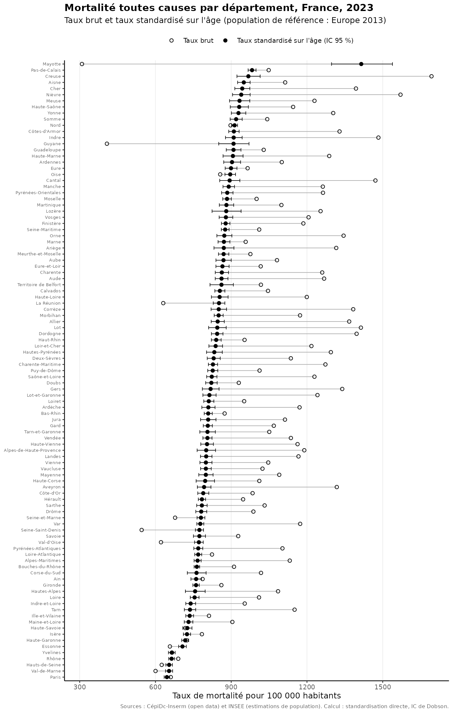
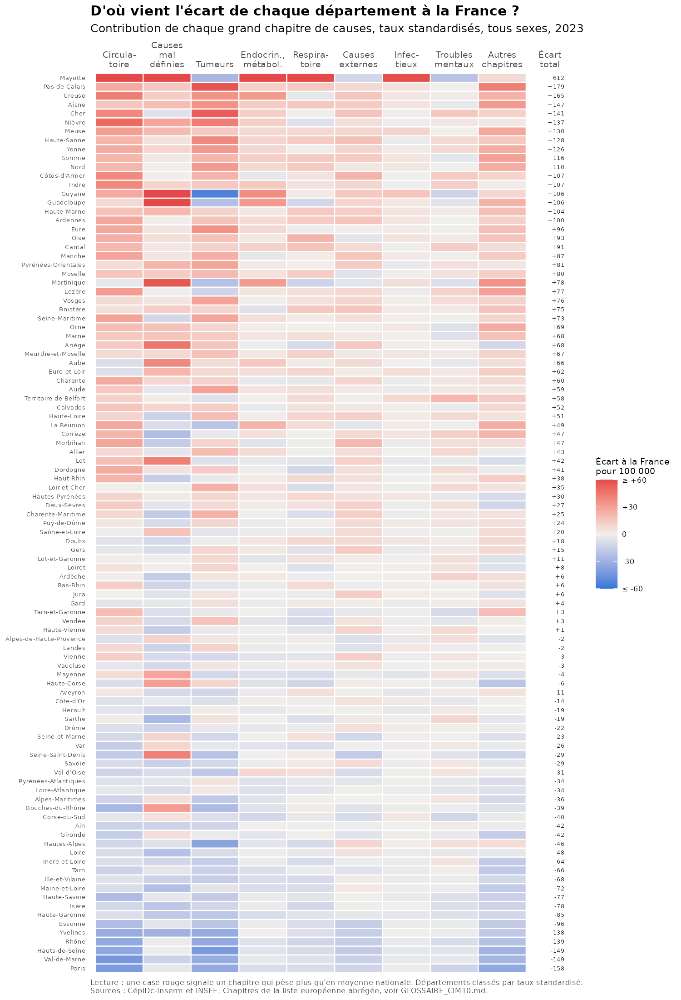

# Inégalités territoriales de mortalité - taux standardisés sur l'âge (CépiDc)

[](https://github.com/paulianne-fontoura/mortalite-territoriale-cepidc/actions)
[](LICENSE)

**Le livrable : [`report/note.pdf`](report/note.pdf).**

> **In English.** A reproducible pipeline comparing mortality across the 101
> French departments on a like-for-like age basis, from CépiDc-Inserm and
> INSEE open data. Age-standardised rates (2013 European Standard Population)
> with 95% confidence intervals, and an exact decomposition of each
> department's gap to the national rate across the 18 chapters of causes of
> death. Python ETL, R analysis, LaTeX technical note, CI on every change.

Chaîne de traitement reproductible qui mesure les écarts de mortalité entre
départements français à structure d'âge comparable, puis cherche de quelles
causes de décès viennent ces écarts. Elle part des **données ouvertes réelles**
du **CépiDc-Inserm** et de l'**INSEE**. Les taux de mortalité sont
**standardisés sur l'âge** par la méthode directe, avec la population de
référence européenne 2013 et leur intervalle de confiance à 95 %, et l'écart de
chaque département à la France est décomposé entre les 18 grands chapitres de
causes.

ETL en **Python** (téléchargement à la source, harmonisation des classes d'âge,
appariement, contrôle qualité, provenance des fichiers), analyse en **R**
(standardisation, intervalles de confiance, décomposition par cause, contrôle
face aux taux publiés par le CépiDc), note technique en **LaTeX** dont chaque
chiffre est écrit par la chaîne.

> Données réelles et publiques, agrégées, téléchargées à la source. Aucune donnée
> individuelle n'est utilisée. La lecture territoriale des taux standardisés
> rejoint le suivi des inégalités sociales et géographiques de santé.

## Résultat



Une fois la structure par âge neutralisée, le taux standardisé va de 645 pour
100 000 à Paris à 1 415 à Mayotte, soit un rapport de 2,2 entre les extrêmes.
Le classement change par rapport au taux brut. Les départements ruraux et âgés
(Creuse, Cher, Nièvre) reculent fortement, les départements à population jeune
(Seine-Saint-Denis, Guyane) remontent. 50 départements sont significativement
au-dessus du taux national, 28 en dessous, 23 ne s'en distinguent pas.

| Département | Taux brut | Taux standardisé | IC 95 % |
|---|---:|---:|---:|
| France entière | 936 | 803 | 801 - 805 |
| Mayotte | 309 | 1 415 | 1 297 - 1 539 |
| Pas-de-Calais | 1 048 | 982 | 967 - 998 |
| Creuse | 1 693 | 968 | 923 - 1 015 |
| Hauts-de-Seine | 625 | 654 | 641 - 667 |
| Paris | 661 | 645 | 634 - 656 |

Toutes causes, tous sexes, 2023, pour 100 000. Chiffres de l'exécution du
1er octobre 2026, le CépiDc signale ses taux 2023 comme provisoires.

## D'où viennent les écarts



La population et les poids étant les mêmes pour toutes les causes, le taux
standardisé toutes causes est exactement la somme des taux par chapitre, et
l'écart d'un département à la France se décompose sans reste. En métropole, les
écarts passent d'abord par les maladies de l'appareil circulatoire et les
tumeurs. Le Pas-de-Calais (+179) doit son écart aux tumeurs (+56), puis à
l'appareil circulatoire (+26) et à l'appareil digestif (+23). Paris (-158) se
situe sous la moyenne nationale surtout pour l'appareil circulatoire (-41) et
les tumeurs (-34).

Outre-mer, la plus forte contribution vient du chapitre des causes mal définies
(+56 à +68 aux Antilles et en Guyane, +199 à Mayotte). Une part des décès y est
enregistrée sans cause précise. C'est une limite de la certification, pas une
pathologie, et elle borne ce que la lecture par cause permet d'affirmer. Au
niveau national, 11 % des décès de 2023 relèvent de ce chapitre.

## Ce que démontre ce projet

- **Aller chercher la donnée à la source** - interrogation scriptée de l'API open
  data du CépiDc (décès par cause, taux publiés, libellés CIM-10) et
  téléchargement du fichier de population de l'INSEE.
- **Méthode épidémiologique** - standardisation directe sur l'âge avec une
  population de référence explicite, intervalles de confiance de Dobson avec
  [PHEindicatormethods](https://cran.r-project.org/package=PHEindicatormethods),
  décomposition exacte des écarts par cause.
- **Auditabilité** - harmonisation documentée des classes d'âge, contrôle qualité
  en JSON, formule écrite à la main confrontée au paquet, recalcul confronté aux
  taux publiés par le CépiDc, empreinte SHA-256 et date de chaque fichier source.
- **Reproductibilité** - chaque chiffre de la note est écrit par la chaîne dans
  un fichier que la note lit, rien n'est tapé à la main. `Makefile` et
  intégration continue rejouent le tout.

## Données

| | |
|---|---|
| Producteurs | CépiDc-Inserm (causes de décès) ; INSEE (population) |
| Décès | Effectifs toutes causes et par grand chapitre de causes, par département, classe d'âge, sexe, 2023 (API CépiDc) |
| Population | Estimations par département, sexe, âge au 1ᵉʳ janvier 2023 (INSEE) |
| Référence d'âge | Population standard européenne 2013 (Eurostat) |
| Causes | 18 chapitres de la liste européenne abrégée, plages CIM-10 dans [GLOSSAIRE_CIM10.md](GLOSSAIRE_CIM10.md) |
| Accès | Données ouvertes et agrégées, sous licence ouverte |

Le détail des variables figure dans [DICTIONNAIRE.md](DICTIONNAIRE.md).

## Lancer le projet

```bash
make setup     # dépendances Python et R
make all       # téléchargement -> ETL -> qualité -> standardisation -> figures -> note PDF
```

L'étape `report` compile `report/note.tex` avec `pdflatex`. La note est aussi
versionnée dans le dépôt.

## Reproductibilité et contrôles

À chaque `push` et à chaque pull request, la CI télécharge les données réelles,
rejoue l'ETL, exécute l'analyse en R, recompile la note et publie le PDF comme
artefact. La chaîne s'arrête si un contrôle échoue - couverture complète
(101 départements, 11 classes d'âge, 3 modalités de sexe), aucune valeur
manquante ou négative, somme des deux sexes égale au total, somme des 18
chapitres égale aux décès toutes causes dans chaque cellule, accord entre
PHEindicatormethods et la formule manuelle.

Face aux taux publiés par le CépiDc, les taux départementaux recalculés ont une
corrélation de 0,989. Le taux national recalculé dépasse de 1,8 % le taux
publié, un écart systématique et du même ordre partout, qui tient
vraisemblablement au regroupement des classes d'âge et au dénominateur au
1ᵉʳ janvier. Une version antérieure de la note donnait 831 pour la France. Ce
chiffre était la moyenne non pondérée des 101 taux départementaux, qui donne à
Mayotte le même poids qu'à Paris. Le taux national, calculé sur la France
entière classe d'âge par classe d'âge, vaut 803.

## Limites

Classes d'âge décennales, les deux premières regroupées pour s'aligner sur
l'INSEE. Dénominateur au 1ᵉʳ janvier 2023 et taux 2023 du CépiDc provisoires,
les chiffres peuvent donc bouger à la révision des sources, d'où l'empreinte
consignée pour chaque fichier. À Mayotte et en Guyane, l'incertitude sur la
population pèse sur les taux. La lecture par cause hérite de la qualité de la
certification des décès, inégale selon les territoires. Un taux standardisé sert
à comparer, il ne se lit pas comme un risque réel observé.

## Licence

Code sous licence MIT (`LICENSE`). Données sous licence ouverte (CépiDc-Inserm, INSEE).
